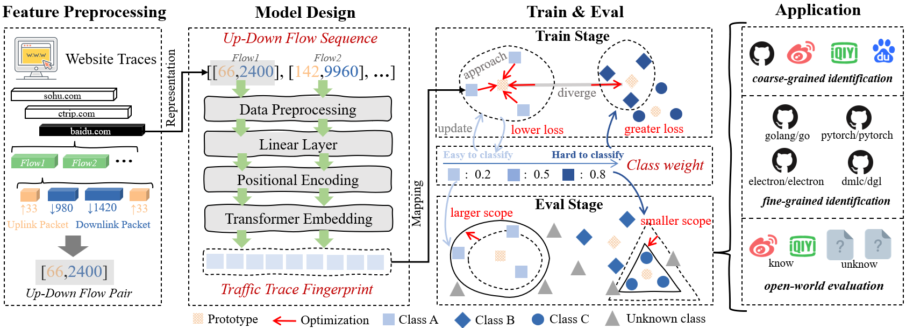

# UDFS
Implementation of "UDFS: Lightweight Representation-Driven Robust Network Traffic Classification"


This repository provides the code and dataset of UDFS for encrypted traffic analysis. It includes the implementation of the **Up-Down Flow Sequence (UDFS)** representation, which compresses traffic traces into discriminative flow-level sequences, as well as an adaptive threshold mechanism for enhancing class-specific discriminability. The repository also contains scripts for training and evaluation on both coarse-grained and fine-grained datasets, supporting experiments under concept drift and open-world scenarios.



If you find this method helpful for your research, please cite our work:

```latex
@misc{xian2025udfs,
      title={UDFS: Lightweight Representation-Driven Robust Network Traffic Classification}, 
      author={Youquan Xian and Xueying Zeng and Mei Huang and Aoxiang Zhou and Xiaoyu Cui and Peng Liu and Lei Cui},
      year={2025},
      eprint={2509.11157},
      archivePrefix={arXiv},
      primaryClass={cs.NI},
      url={https://arxiv.org/abs/2509.11157}, 
}
```

-----

### Requirements
```
matplotlib==3.10.6
numpy==2.3.3
pandas==2.3.2
scapy==2.6.1
scikit_learn==1.7.2
torch==2.7.0+cu118
tqdm==4.67.1
```


-----

### Dataset Format

The dataset is expected to be in the form of a **pickled Pandas DataFrame** (`.pkl`). Each `.pkl` file should represent a complete dataset (e.g., for training or testing).

The DataFrame must contain at least two columns:

  - `features`: A list or NumPy array represents the characteristics of a complete access record (trace) to a website represented by UDFS.
  - `label`: A string representing the application or class index (e.g., `0`, `1`).

An example of the DataFrame structure:

|    |   label | features                                                                                                                                                                                                                                              |
|---:|--------:|:------------------------------------------------------------------------------------------------------------------------------------------------------------------------------------------------------------------------------------------------------|
|  0 |       5 | [[8218, 306213], [11155, 997100], [1829, 5857], [1893, 5857], [1893, 5857], [1893, 5857], [1829, 5857], [6143, 9325931], [2588, 4922]]                                                                                                                |
|  1 |       7 | [[2438, 123706], [1797, 5857], [1893, 5857], [10972, 774600], [1829, 5857], [1797, 5857], [1829, 5857], [2641, 4398]]                                                                                                                                 |
|  2 |       7 | [[2502, 123775], [11004, 768523], [1893, 5857], [1861, 5857], [1893, 5857], [1829, 5857], [1861, 5857], [2019, 4398]]                                                                                                                                 |
-----

### How to Use

#### Step 1: Configure the Project

Before running the script, open `main.py` and configure the paths and hyperparameters in the **Configuration** section at the top of the file.

  - **Dataset Paths:** Set `TRAIN_PKL` and `TEST_PKL` to point to your training and testing `.pkl` files.
  - **Output Directory:** Specify the `SAVE_DIR` where all model artifacts and results will be saved.
  - **Model & Training Hyperparameters:** Adjust parameters like `LR`, `EPOCHS`, `BATCH_SIZE`, `D_MODEL`, etc., as needed for your specific dataset.

#### Step 2: Train The Model and Evaluate

The script handles training, evaluation, and visualization in a single run. Execute the main script from your terminal:

```bash
python main.py
```

This command will perform the following actions:

1.  Load the training and testing data.
2.  Train the Flow Transformer model using the Adaptive Prototypical Loss.
3.  Calculate and save global class prototypes.
4.  Compute and save dynamic, class-specific thresholds for open-set recognition.
5.  Evaluate the model's performance on both **closed-set** and **open-set** tasks.
6.  Generate and save a t-SNE visualization of the feature space.

#### Step 3: Analyze the Outputs

After the script finishes, all artifacts will be saved in the directory specified by `SAVE_DIR`. The key output files include:

  - `flow_transformer.pt`: The trained model weights.
  - `label_encoder.pkl`: The label encoder mapping class names to integer indices.
  - `prototypes.pt`: The computed feature prototype for each known class.
  - `dynamic_thresholds.pt`: The learned distance threshold for each known class, used for identifying unknown traffic.
  - `tsne_visualization_dynamic_threshold.png`: The t-SNE plot visualizing the learned feature embeddings for the training and testing data.

The console output will provide detailed classification reports and performance metrics (Accuracy, Precision, Recall, F1-score) for both closed-set and open-set scenarios.